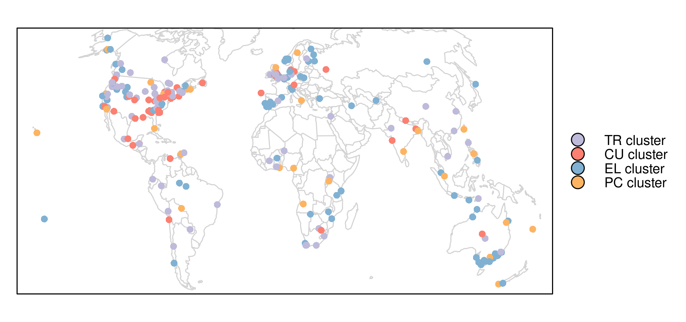

```{r setup, include=FALSE}
knitr::opts_chunk$set(echo = TRUE)
```

## Reviewing qualitative GIS research – towards a wider usage of open source GIS and reproducible research practices

This is the online code repository of the Geography Compass publication "Reviewing qualitative GIS research – towards a wider usage of open source GIS and reproducible research practices".
The [data](https://github.com/jannes-m/qual_gis/tree/master/data) is analzed in the scripts found under [code](https://github.com/jannes-m/qual_gis/tree/master/code).
[images](https://github.com/jannes-m/qual_gis/tree/master/images) and [figures](https://github.com/jannes-m/qual_gis/tree/master/figures) represent the output of the corresponding analyses.

The online version of the figure below (Figure 4 in the manuscript) can be viewed [here](http://mccoy.geogr.uni-jena.de:3838/jannes/cluster_map/).

<p align = "center">
  
</p>